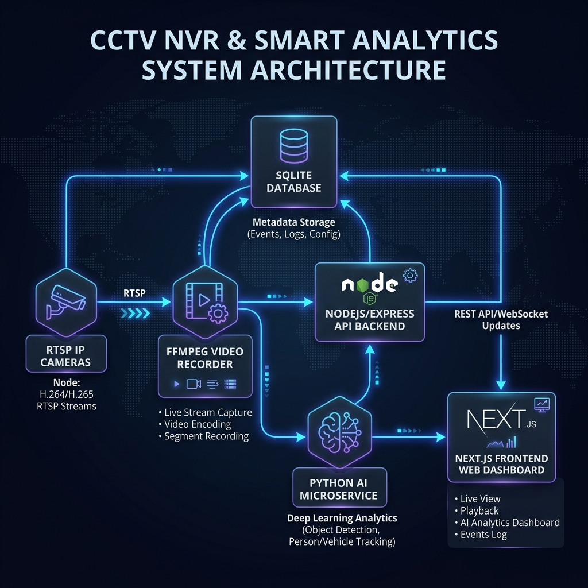

# Streamify CCTV NVR & Smart Analytics System

Streamify is a lightweight, unified Network Video Recorder (NVR) and CCTV smart analytics application designed to run efficiently on single-board computers such as the Raspberry Pi 4. It supports real-time RTSP stream viewing, persistent HLS recording segments, automated retention cleanup, and a web-based dashboard for camera feed management and system monitoring.

---

## 🏗️ System Architecture

Streamify consists of three decoupled components running in harmony:
1. **Frontend Dashboard**: Built with Next.js, React, and modern UI styling. It provides live camera monitoring, playback controls, system configuration, and live detection log views.
2. **Backend API**: An Express and TypeScript-based API server that manages camera profiles, user authentication, SQLite configurations, and exposes endpoints for logs/analytics.
3. **Recorder Daemon**: A background service that orchestrates `ffmpeg` processes to capture H.264 video streams from configured RTSP URLs, writing them into structured HLS segments with automatic retention management.

### Architecture Diagram


---

## 🚀 Key Features

* **Live RTSP Streaming**: Low-latency HLS streaming visible directly in modern web browsers.
* **Continuous Segmented Recording**: Automates `ffmpeg` to capture streams into customizable chunks (default: 5 minutes/300 seconds).
* **Automated Retention Cleanup**: A background worker that automatically deletes old recordings exceeding the retention policy threshold (default: 7 days) to conserve storage space.
* **Unified Setup**: Full Raspberry Pi environment setup and service installer script.
* **Robust Service Wrapper**: Runs components as headless systemd services on startup, with crash-recovery policies.
* **Roadmap Additions**:
  * **Dockerization**: Quick containerized setup via Docker Compose.
  * **Python AI Microservice**: On-device deep learning analytics including **Facial Recognition** (identifying registered persons and capturing snapshots), **Unknown Person Alerts**, and **People Counting** over time.

---

## 🛠️ Prerequisites

Before installing, ensure your Raspberry Pi or host system meets the following requirements:
* **Operating System**: Raspberry Pi OS (64-bit recommended) or any Debian/Ubuntu-based distribution.
* **Hardware**: Raspberry Pi 4 (or newer) with adequate disk space/microSD for video storage.
* **Network**: The Pi must be connected to the same local network as the RTSP IP Cameras.
* **Software**:
  * Node.js (v18.x or v20.x recommended)
  * NPM (v9.x or newer)
  * FFmpeg (compiled with h264 support)
  * SQLite3

---

## 📥 Installation & Deployment on Raspberry Pi

The workspace contains a unified script `scripts/setup-pi.sh` to install dependencies, compile the project, and register components as systemd background services automatically.

### 1. Clone the Repository
```bash
git clone https://github.com/Aryamgupta/Streamify.git
cd Streamify
```

### 2. Run the Setup Script
Execute the installer with `sudo`. The script dynamically resolves non-root execution paths to ensure file ownership is preserved:
```bash
sudo ./scripts/setup-pi.sh
```
This script will:
* Install system dependencies (`ffmpeg`, `nodejs`, `npm`) via apt.
* Build backend TypeScript assets into `backend/dist/`.
* Compile the Next.js frontend production bundle.
* Generate and copy customized systemd service descriptors into `/etc/systemd/system/`.
* Reload the systemd daemon, enable services on boot, and start them.

---

## 🐳 Docker Deployment (Containerized Alternative)

For a portable, isolated deployment (useful on Raspberry Pi, local development machines, or remote servers) that handles dependencies automatically, you can run Streamify using Docker Compose.

### 1. Prerequisites
Ensure you have Docker and the Docker Compose plugin installed:
```bash
sudo apt-get update
sudo apt-get install -y docker.io docker-compose-v2
```

### 2. Run the Stack
Run the following command to build the images and start the services in detached (background) mode:
```bash
docker compose up -d --build
```
This will:
* Build the backend service (with compilation of TS files and native `sqlite3` bindings) and install `ffmpeg`.
* Build the Next.js frontend in standalone mode.
* Spin up three containers (`cctv-backend`, `cctv-recorder`, and `cctv-frontend`) sharing the necessary volumes for database files, HLS live playlists, and recording segments.

### 3. Container Management Commands
* **View status**: `docker compose ps`
* **View logs**: `docker compose logs -f [service_name]` (e.g. `docker compose logs -f recorder`)
* **Stop services**: `docker compose down`
* **Restart services**: `docker compose restart`

### 4. RAM Disk (SD Card Optimization)
By default, HLS live playlists are stored in a Docker named volume. To use your system's RAM disk (`/dev/shm`) and avoid wearing out your Raspberry Pi SD card:
1. Open [docker-compose.yml](file:///home/aryam/Documents/cctv-analysis/docker-compose.yml).
2. Locate the `volumes` parameter for both the `backend` and `recorder` services.
3. Comment out `- cctv-live:/app/live` and uncomment `- /dev/shm/cctv-live:/app/live`.
4. Re-deploy the stack: `docker compose up -d`.

---

## ⚙️ Service Control & Monitoring

Once installed, three systemd services manage the background tasks:
* `cctv-backend.service`: Runs the Express API backend.
* `cctv-recorder.service`: Runs the continuous RTSP stream capture daemon.
* `cctv-frontend.service`: Runs the Next.js production web server.

### Controlling Services
Use the helper scripts located in the `scripts/` folder to manage the state of all services at once:

* **Stop Services**:
  ```bash
  sudo ./scripts/stop-services.sh
  ```
* **Restart Services**:
  ```bash
  sudo ./scripts/restart-services.sh
  ```
* **Uninstall / Detach Services**:
  ```bash
  sudo ./scripts/uninstall-services.sh
  ```

### Checking Status and Logs
To query the current status or check live output streams, use standard systemd utilities:

* **Verify service status**:
  ```bash
  systemctl status cctv-backend
  systemctl status cctv-recorder
  systemctl status cctv-frontend
  ```
* **Read live service logs**:
  ```bash
  journalctl -u cctv-backend -f
  journalctl -u cctv-recorder -f
  journalctl -u cctv-frontend -f
  ```

---

## 🛠️ Service Customization & Placeholders

The `.service` files in the `scripts/` directory act as templates containing default placeholders:
* **Placeholder User**: `User=aryam`
* **Placeholder Path**: `WorkingDirectory=/home/aryam/Streamify/...`

### How It Works
When you run the installation scripts (`sudo ./scripts/setup-pi.sh` or `sudo ./scripts/install-services.sh`), the script dynamically resolves:
1. **The original executing non-root user**: Replaces `User=aryam` with the dynamic `$REAL_USER` (resolving via `SUDO_USER` or `logname`).
2. **The absolute cloned path**: Replaces `/home/aryam/Streamify/` with the detected absolute path of your workspace.

### Manual Customization
If you prefer running services under a different configuration or a custom system user:
1. Open the template service files:
   * `scripts/cctv-backend.service`
   * `scripts/cctv-recorder.service`
   * `scripts/cctv-frontend.service`
2. Change the `User` and `WorkingDirectory` fields manually.
3. Align the replacement strings in `scripts/setup-pi.sh` and `scripts/install-services.sh` or copy the modified services directly to `/etc/systemd/system/` manually.

---

## 🔐 Default Access & Settings

* **Web UI Dashboard URL**: [http://localhost:3000](http://localhost:3000) (or `http://<pi-ip>:3000` from your network)
* **Default Admin Account**:
  * **Username**: `admin`
  * **Password**: `admin123`
  * *Note: Please change the administrator password upon first login for security.*
* **SQLite Database**: Maintained at `backend/data/nvr.db`.
* **Video Directory**: Recorded video files are saved to `recordings/` in the root workspace directory.
