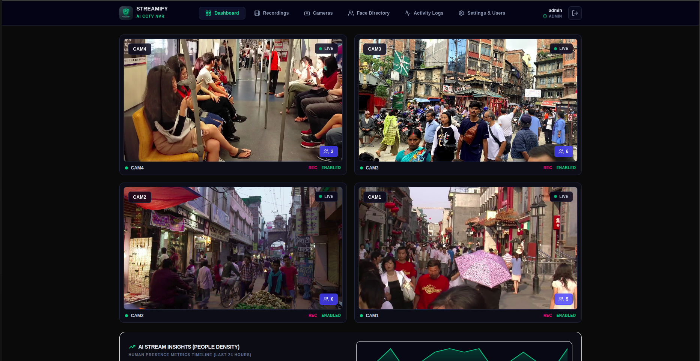
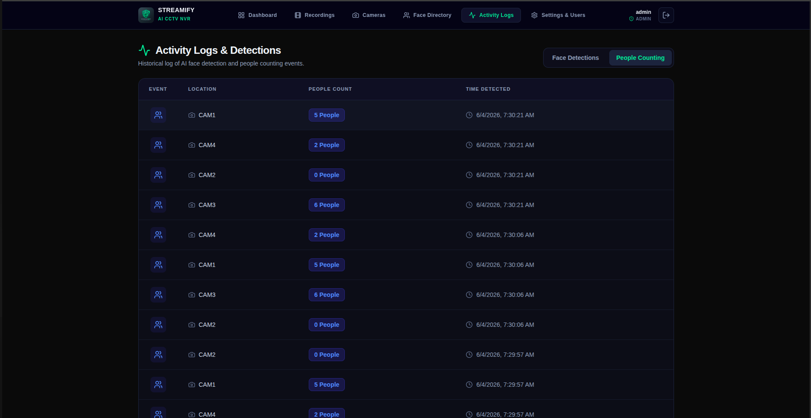
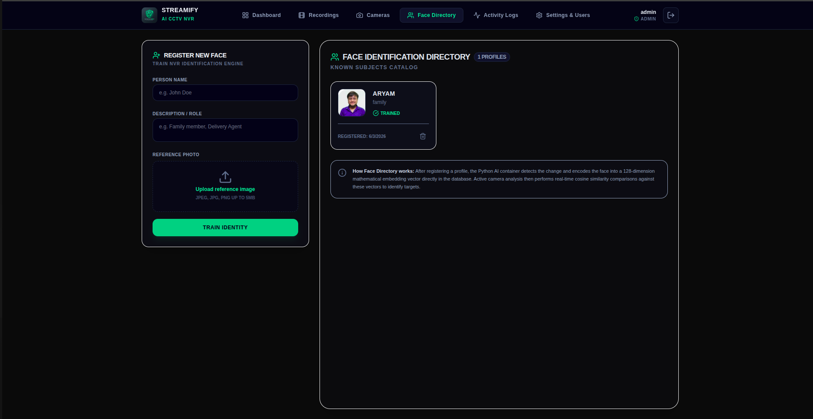
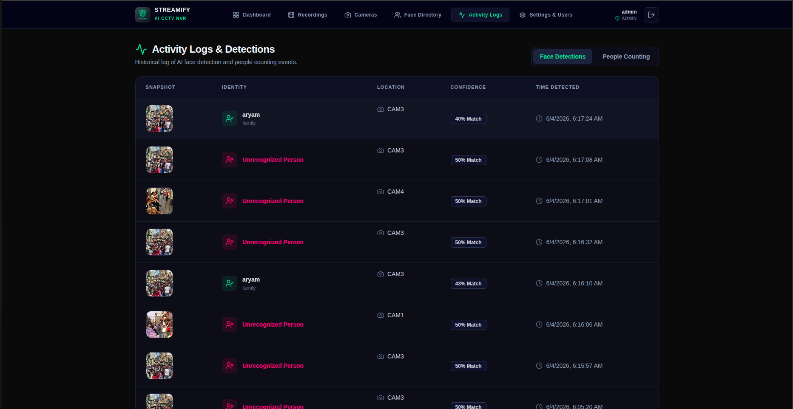
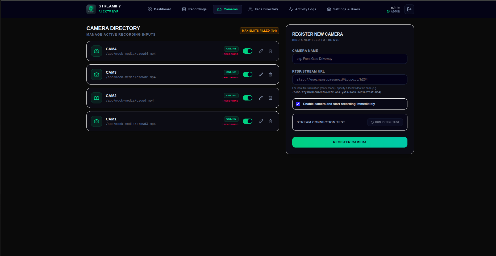
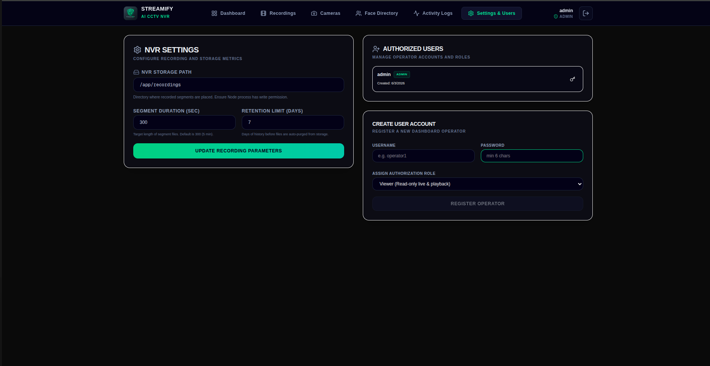

# Streamify: AI-Powered CCTV NVR System 🛡️

Streamify is an advanced, lightweight Network Video Recorder (NVR) and smart analytics platform designed to bring enterprise-level AI capabilities to standard CCTV feeds.

---

## 🚀 Key Features & Highlights

### 1. Real-Time AI Telemetry & Dashboard
Monitor all your camera streams in a sleek, responsive grid. The dashboard provides instant alerts via Server-Sent Events (SSE) and live graphs showing human density and presence over time.
- **Instant Alerts:** Get notified instantly when a known or unknown person enters the frame.
- **Resource Monitoring:** Keep an eye on storage usage and system loads directly from the dashboard.

### 2. Live People Counting & Activity Tracking

The integrated Python AI microservice constantly scans camera feeds using a MobileNet-SSD model to count people in real-time. The count is overlaid directly onto your live camera feeds.

### 3. Smart Face Directory

Build a database of authorized personnel or persons of interest. Upload a photo, and the AI automatically generates an embedding. When that person is spotted on any camera, the system recognizes them with high accuracy using `dlib` facial recognition.

### 4. Comprehensive Activity Logs

Never miss an event. The system automatically saves snapshots of detected faces and logs every people-count fluctuation. Toggle between "Face Detections" and "People Counting" logs to review historical data effortlessly.

### 5. Seamless Camera Management

Easily add, edit, or disable camera streams. Enter any valid RTSP URL (or local mock files for testing) and the backend instantly orchestrates FFmpeg processes to capture and index HLS segments.

### 6. Admin & User Settings

Manage global system preferences, user roles, and access controls from a secure settings panel.

---

## 🛠️ Technology Stack

Streamify is built on a decoupled, modern microservices architecture:

- **Frontend Application**
  - **Framework:** Next.js & React
  - **Styling:** Tailwind CSS
  - **Language:** TypeScript
  - **Icons:** Lucide React

- **Backend NVR & Orchestration**
  - **Runtime:** Node.js & Express
  - **Database:** SQLite3
  - **Streaming:** FFmpeg (H.264 to HLS conversion)
  - **Real-time Comms:** Server-Sent Events (SSE)

- **AI Analytics Microservice**
  - **Language:** Python
  - **Computer Vision:** OpenCV (`cv2`)
  - **Object Detection:** MobileNet-SSD (Caffe Model)
  - **Facial Recognition:** `face_recognition` (dlib)

- **Infrastructure & Deployment**
  - Docker & Docker Compose
  - Multi-container orchestration (Backend, AI, Recorder, Frontend)

---

## 🏗️ System Architecture

The application utilizes a background **Recorder Daemon** to handle continuous fragmented video capturing, preventing memory bloat. The **AI Service** runs independently, pulling frames and pushing JSON webhooks back to the Node API whenever a detection occurs, ensuring the main server remains lightning fast.
